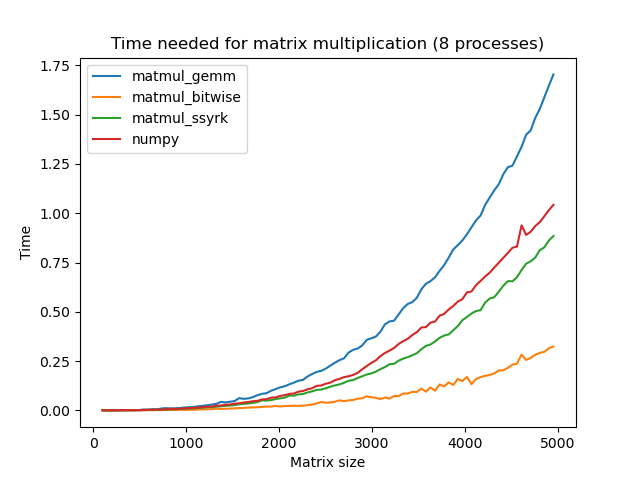

# ultraspeed
Fast multiplication of binary square matrices; fast multiplication of non-square matrices is in progress; 
Main idea of the implementation is to bit-pack binary matrices and run bitwise operations ("ADD" and popcount) instead of multiply-add operations.

Package also contains alternative implementations which rely on AMD BLIS library (for benchmarking purposes), hence BLIS and BLIS headers needs to be installed (and file "blis.h" available for import).
AMD BLIS library can be found [here](https://www.amd.com/en/developer/aocl/blis.html).

OpenMP is also needed for multiprocessing. 

## Installation:
run `python setup.py install`

## Usage:
To run a matmul implementation for two matrices A, C you need to run:

`import ultraspeed`
`ultraspeed.matmul_bitwise(A, C, m_size)`
